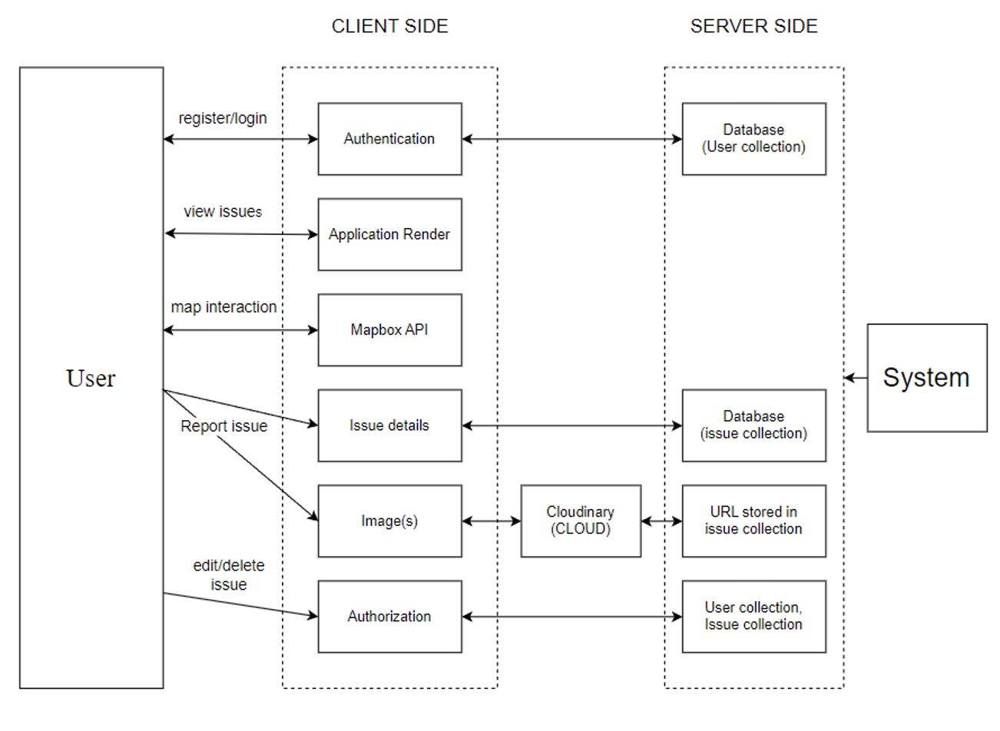

## Street Guard

<!-- PROJECT LOGO -->
<br />
<p align="center">
  <a href="https://github.com/VamshiReddy02/streetGuard">
     
  </a>

  <p align="center">
    This is an <b>Urban Issue Reporting Web Application</b> aspires to address a wide spectrum of challenges faced by urban communities related to infrastructure maintenance and safety. The primary focus is on providing an efficient and collaborative platform for reporting and resolving issues such as potholes, damaged roads, debris obstruction,and flooding. 
    <br />
    <br />
    <a href="">Video Demo</a>
    ·
    <a href="https://github.com/VamshiReddy02/streetGuard/issues">Report Bug</a>
    ·
    <a href="https://github.com/VamshiReddy02/streetGuard/issues">Request Feature</a>
  </p>
</p>


<!-- TABLE OF CONTENTS -->

## Table of Contents
- [Project Architecture ](#project-architecture )
- [About the Project](#about-the-project)
  - [Built With](#built-with)
- [Getting Started](#getting-started)
  - [Prerequisites](#prerequisites)
  - [Installation](#installation)
- [Roadmap](#roadmap)
- [Contribution](#contribute)
- [Contact](#maintainer)

<!-- Project Architecture  -->
## Project Architecture  

<p align="center">

</p>

<!-- ABOUT THE PROJECT -->

## About The Project

The Urban Issue Reporting Web Application aspires to address a wide spectrum of challenges faced by urban communities related to infrastructure maintenance and safety. The primary focus is on providing an efficient and collaborative platform for reporting and resolving issues such as potholes, damaged roads, debris obstruction,and flooding. The project's scope encompasses the following key aspects:                                               

1. Develop a user-centric Urban Issue Reporting Web Application.
2. Implement an intuitive interface for citizens to report urban infrastructure    challenges effortlessly.
3. Enable precise geospatial location identification and real-time communication for efficient issue resolution.


### Built With

- [EJS](https://ejs.co/)
- [Node](https://nodejs.org/en/)
- [Express](https://expressjs.com/)
- [MongoDB](https://www.mongodb.com/)


<!-- GETTING STARTED -->

## Getting Started

To get a local copy up and running follow these simple steps.

### Prerequisites

This is an example of how to list things you need to use the software and how to install them.

- npm

```sh
npm install npm@latest -g
```

### Installation

1. Clone the repo

```sh
git clone https://github.com/github_username/repo.git
```

2. Install NPM packages

```sh
npm install
```

<!-- ROADMAP -->

## Roadmap

See the [open issues](https://github.com/VamshiReddy02/streetGuard/issues) for a list of proposed features (and known issues).

<!-- CONTRIBUTING -->

## Contribute

Follow the following instructions to start contributing.

**1.** Fork [this](https://github.com/VamshiReddy02/streetGuard) repository.

**2.** Clone your forked copy of the project.

```
git clone --depth=1 https://github.com/<your-username>/layer5.git
```

**3.** Navigate to the project directory.

```
cd streetGuard
```

**4.** Add a reference(remote) to the original repository.

```
git remote add upstream https://github.com/VamshiReddy02/streetGuard
```

**5.** Check the remotes for this repository.

```
git remote -v
```

**6.** Always take a pull from the upstream repository to your master branch to keep it at par with the main project (updated repository).

```
git pull upstream master
```

**7.** Create a new branch.

```
git checkout -b <your_branch_name>
```

**8.** Install the dependencies for running the site.

```
npm install
```

**9.** Make the desired changes.

**10.** Run the site locally to preview changes.

```
nodemon index.js
```

**11.** Track your changes.

```
git add .
```

**12.** Commit your changes.

```
git commit --signoff -m "<commit subject>"
```

or you could go with the shorter format for the same, as shown below.

```
git commit -s -m "<commit subject>"
```

**13.** While you are working on your branch, other developers may update the `master` branch with their branch. This action means your branch is now out of date with the `master` branch and missing content. So to fetch the new changes, follow along:

```
git checkout master
git fetch origin master
git merge upstream/master
git push origin
```

Now you need to merge the `master` branch into your branch. This can be done in the following way:

```
git checkout <your_branch_name>
git merge master
```

**14.** Push the committed changes in your feature branch to your remote repo.

```
git push -u origin <your_branch_name>
```

**15.** Once you’ve committed and pushed all of your changes to GitHub, go to the page for your fork on GitHub, select your development branch, and click the pull request button. Please ensure that you compare your feature branch to the desired branch of the repo you are supposed to make a PR to. If you need to make any adjustments to your pull request, just push the updates to GitHub. Your pull request will automatically track the changes in your development branch and update it.


## Maintainer
Important decisions regarding the project are taken by the following maintainer.

| Vamshi        |
| :-------------: |
|       |
| [@imabp](https://github.com/vamshireddy02)      |
